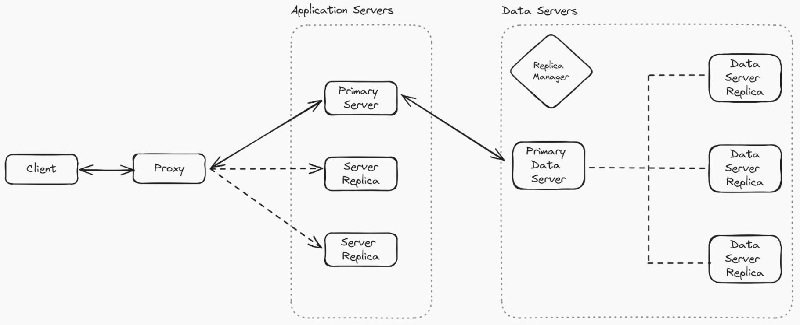
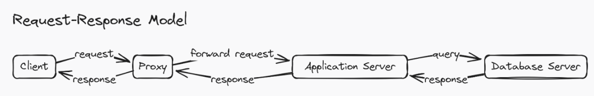
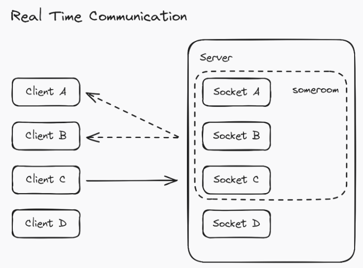

#  LiteLine

## Setup

### Running Client
```
# go to client folder
$ cd client

# for development
$ npm start

# for production
$ npm build
```
- Live app: https://liteline-1.onrender.com/

### Running Proxy
```
# go to proxy folder
$ cd proxy

# for development
$ npm run proxy

# for production
$ node proxy.js
```
- Live proxy: https://liteline-proxy.onrender.com/

### Running App Server
```
# go to server folder
$ cd server

# for development
$ npm run server

# for production
$ node server.js
```
- Primary app server: https://liteline-532q.onrender.com/
- Replica 1: https://liteline-server-1.onrender.com/
- Replica 2: https://liteline-server-2.onrender.com/
- Replica 3: https://liteline-server-3.onrender.com/
- Replica 4: https://liteline-server-4.onrender.com/

## Architecture


## Communication Model

